# AgroSynth Weather Intelligence

AgroSynth Weather Intelligence is an open-source, modern weather intelligence platform designed for agriculture and community use. It provides real-time weather data, user-generated alerts, AI-powered predictions, and interactive weather maps—all in a beautiful, responsive web app.

🎥 [Watch Demo Video](https://www.youtube.com/watch?v=clavoPIzdBc)

## Contributors
- [Shresth](https://github.com/ShresthKapoor7)
- [Aditya](https://www.linkedin.com/in/aditya-maheshwari-56b544251/)
- [Hannah](https://www.linkedin.com/in/hannah-hb1225/)
- [Tram](https://www.linkedin.com/in/ngoctramnguyen22/)
- [Tanishq](https://www.linkedin.com/in/tanishq-sharma-ts/)


## Features

- **Home Dashboard**: Overview of all features and quick navigation.
- **User Alerts**: Create, manage, and view custom weather alerts with text, images, location, and weather type (rain, sun, wind, heatwave, flood, hailstorm, anomaly, pest swarm, etc.).
- **Windy Map**: Explore real-time weather overlays and detailed meteorological data using the Windy integration.
- **AI Alerts**: Get AI-powered predictions and insights for future weather events using advanced LLMs.
- **Report Alert**: Submit weather events with location picking (map or geolocation), image upload (Supabase), and see a list of all reported alerts.
- **Mobile Responsive**: Fully responsive UI/UX for mobile, tablet, and desktop.
- **Persistent Storage**: User alerts are saved in supabase and images are uploaded to Supabase Storage.

<p align="center">
  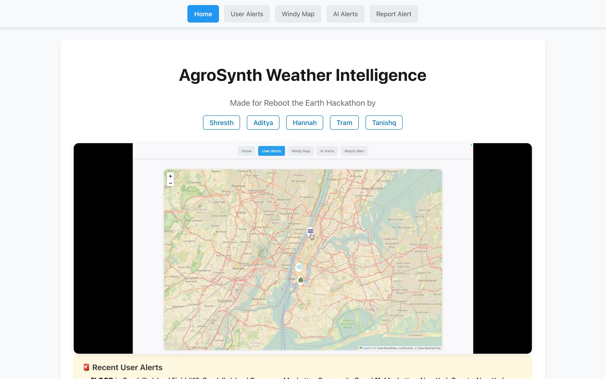
  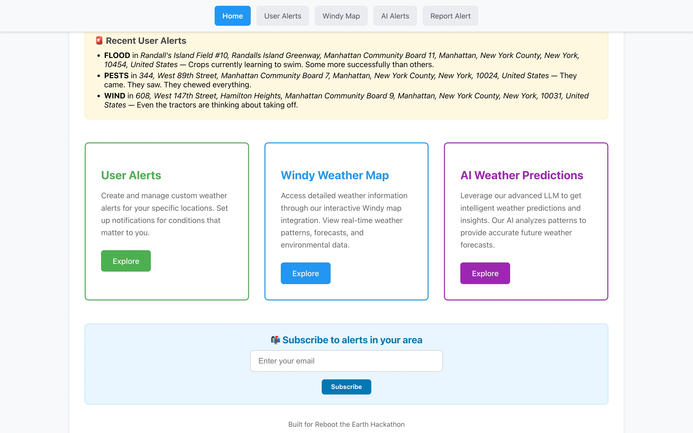
</p>
<p align="center">
  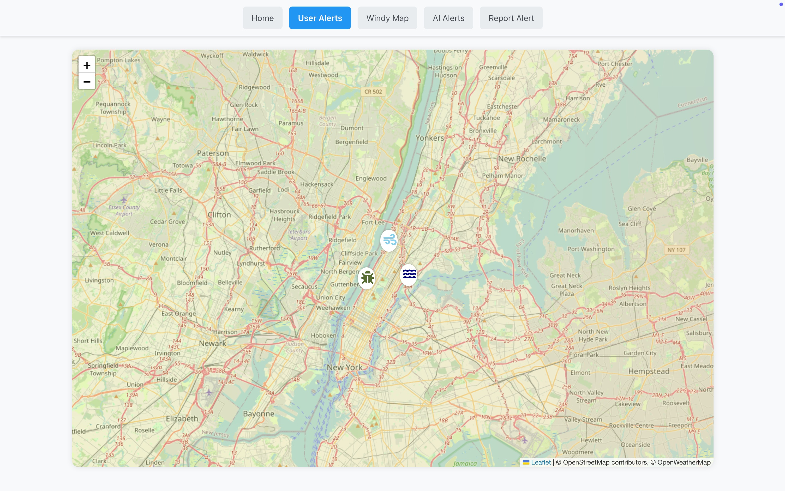
  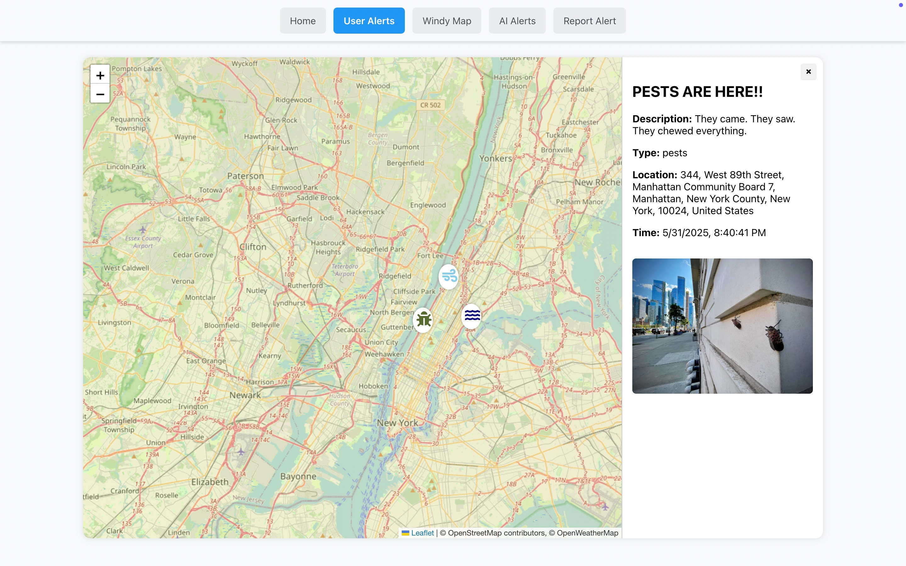
</p>
<p align="center">
  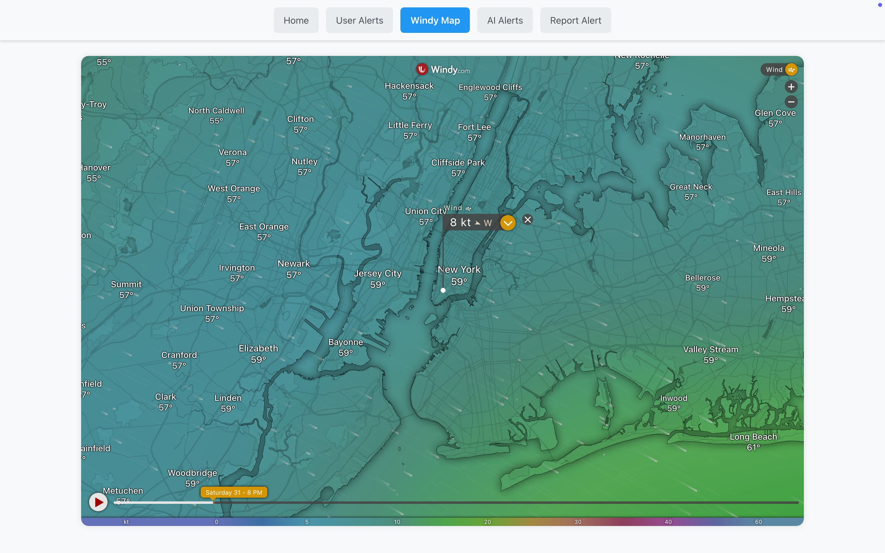
  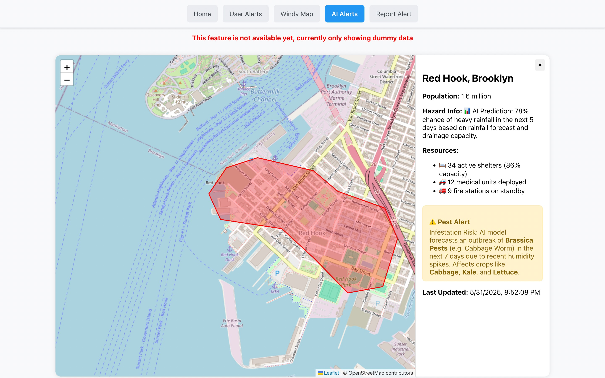
  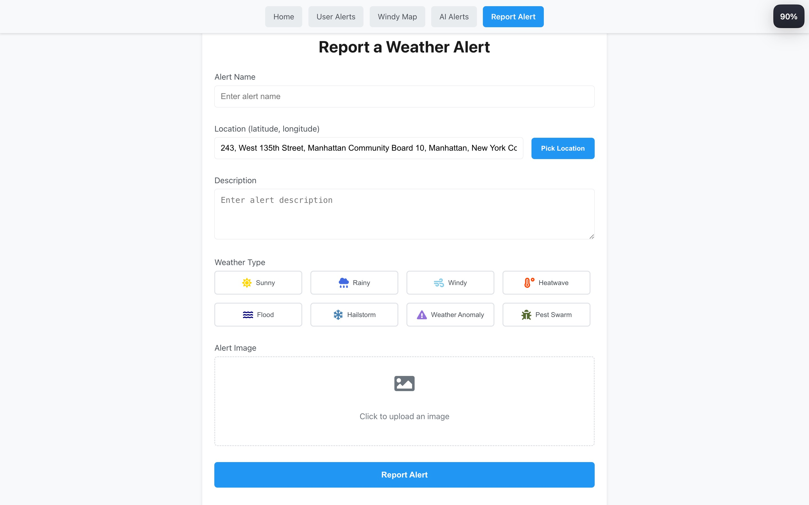
  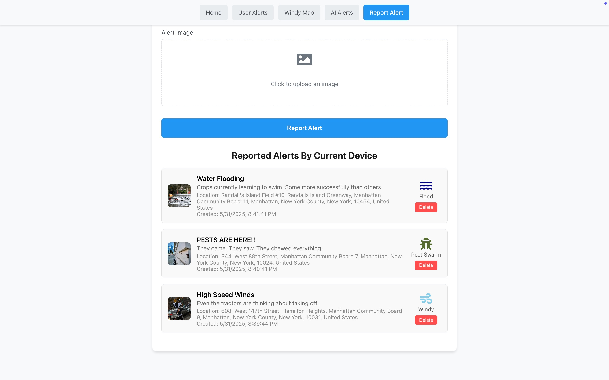
</p>
<p align="center">
  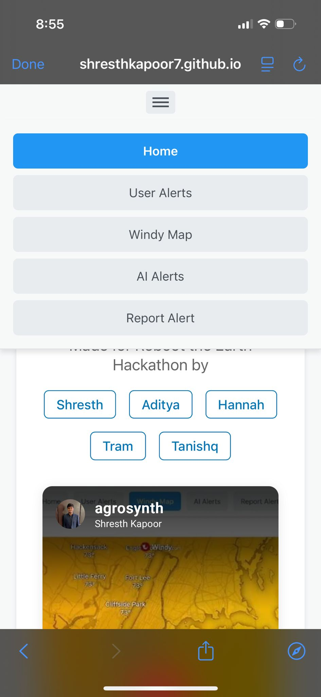
  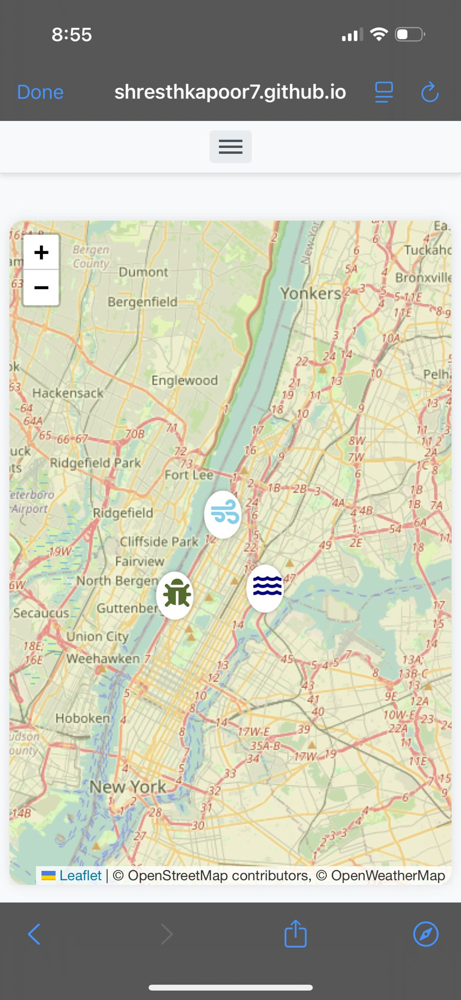
  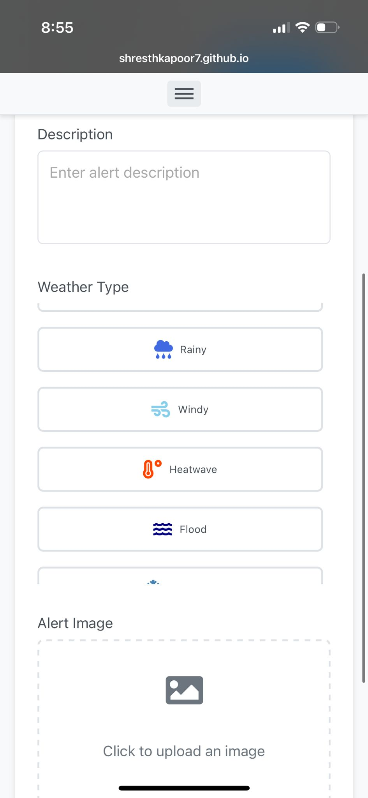
  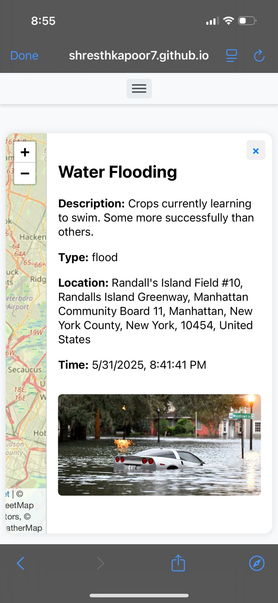
</p>

## RAG Backend
https://github.com/Tans37/AgroSynth-RAG

## Tech Stack
- React (with functional components and hooks)
- React Router DOM
- React Leaflet (for maps)
- Supabase (for image storage) and Storing alerts
- React Icons

## Getting Started

### Prerequisites
- Node.js (v16+ recommended)
- npm

### Installation

1. Clone the repository:
   ```bash
   git clone https://github.com/yourusername/agrosynth.git
   cd agrosynth
   ```
2. Install dependencies:
   ```bash
   npm install
   ```
3. Set up Supabase:
   - Create a [Supabase](https://supabase.com/) project.
   - Create a storage bucket named `alerts`.
   - Copy your Supabase URL and anon key.
   - Create a `src/supabase.js` file:
     ```js
     import { createClient } from '@supabase/supabase-js';
     export const supabase = createClient('YOUR_SUPABASE_URL', 'YOUR_SUPABASE_ANON_KEY');
     ```

### Running the App

```bash
npm start
```
Open [http://localhost:3000](http://localhost:3000) in your browser.

## Usage
- **Home**: See all features and navigate quickly.
- **User Alerts**: Add alerts with name, description, weather type, image, and location. Alerts are listed and persisted.
- **Report Alert**: Pick a location (map/geolocation), upload an image, and submit a weather event. All reports are listed below the form.
- **Windy Map**: View interactive weather overlays for NYC and beyond.
- **AI Alerts**: See AI-driven weather predictions (LLM integration point).

## Project Structure

```
src/
  App.js            # Main app and routing
  pages/
    HomePage.jsx
    UserAlertsPage.jsx
    CreateAlert.jsx
    WindyEmbed.jsx
    AIAlertsPage.jsx
    HeatmapPage.jsx
  supabase.js       # Supabase client setup
```

---

<p align ="center">Built for the Reboot The Earth Hackathon 🚀 </p>
